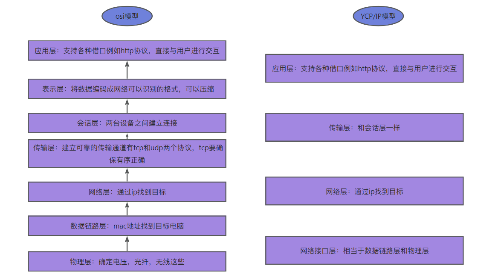

# 计算机网络 - 网络基础
*学习时间：10/28/2025*

## 一、TCP/IP 模型和 OSI 模型分别是什么？它们之间有什么区别？

例如OSI模型，用电脑软件给朋友发送一条信息，会首先应用层为聊天界面，然后表示层翻译为网络可以识别的格式，然后建立会话和传输，在传输的过程中有TCP和UDP两种，TCP完整有序，UDP不会保证这个，然后网络层在这层会根据IP找到对方路由器，然后数据链路层，这层会根据MAC地址找到具体的电脑，最后在物理层进行光纤信息的传输。对方想要读取的话就反过来进行剥离。

**会话层的工作依赖于传输层和网络层的支持**，而这些底层功能在实际操作中先于会话层发生。

## 二、什么是网络分层模型？它在网络通信中有什么作用？

**网络分层模型**是一种将网络通信过程分解为多个层次的设计方法，每一层都有特定的功能和协议。分层模型通过分割复杂的网络通信任务，简化网络的设计、实现和维护。

### OSI 模型的七层结构
OSI模型定义了网络通信的**七层结构**，从底层到顶层分别是：
|层次|功能|常见协议/技术|
|:---:|:---:|:---:|
|物理层|负责硬件信号的传输，包括电缆、光纤、无线信号等。|Ethernet、Wi-Fi、Bluetooth|
|数据链路层|负责数据帧的封装、传输和错误检查，管理物理地址（MAC地址）。|Ethernet、PPP、HDLC|
|网络层|负责逻辑地址（IP地址）的分配，提供路由选择功能，支持跨网段通信。|IP（IPv4、IPv6）、ICMP、ARP|
|传输层|负责端到端的传输，确保数据的可靠性、完整性和顺序。|TCP、UDP、SCTP|
|会话层|负责建立、管理和终止会话，支持多用户之间的连接。|NetBIOS、RPC、SIP|
|表示层|负责数据的格式化、加密和解密，确保发送方和接收方能正确理解数据。|TLS/SSL、JPEG、MPEG、ASCII|
|应用层|提供用户和网络之间的接口，支持各种网络服务。|HTTP、FTP、SMTP、DNS、Telnet、DHCP|

### TCP/IP 模型的四层结构
TCP/IP模型是互联网的实际标准，其**四层结构**和OSI模型的关系如下：
|TCP/IP层|OSI层|功能|
|:---:|:---:|:---:|
|应用层|应用层、表示层、会话层|提供用户接口，支持数据的表示、加密和解密。|
|传输层|传输层|提供端到端的可靠或快速数据传输服务。|
|网络层|网络层|提供逻辑地址的分配和跨网段的数据传输。|
|链路层|数据链路层、物理层|管理数据帧传输，处理硬件信号的物理传输。|

## 三、什么是网络协议？它在网络通信中有什么作用？

- **定义**：网络协议是一组规则和标准，用于确定计算机之间如何进行通信。它定义了数据的格式、传输方式和错误处理等方面。
- **作用**：它确保不同设备和系统之间可以互相理解并正确交换数据，是实现网络通信的基础。没有协议，设备之间无法有效地交换信息。

## 四、什么是 ARP 协议？它在网络通信中有什么作用？

**知识索引**：
- **计算机网络**：数据链路层与网络层交互
- **协议**：地址解析协议（ARP，Address Resolution Protocol）

### 【简要回答】
- **ARP协议**：一种用于将网络层IP地址解析为数据链路层MAC地址的协议。
- **作用**：在局域网中，帮助设备通过已知的IP地址找到对应的MAC地址，从而实现网络通信。
- **工作流程**：
  - 设备发送ARP请求广播，询问目标IP地址的MAC地址。
  - 目标设备通过ARP响应单播返回其MAC地址。
- **常见问题**：ARP缓存中可能存在被攻击者伪造的记录，导致ARP欺骗。

### 【详细回答】
- **ARP协议定义与背景**：
  - 在网络通信中，数据链路层使用MAC地址传递数据帧，而网络层使用IP地址定位设备。ARP协议充当桥梁，完成IP到MAC的地址解析。
  - 只适用于同一个局域网，因为广播包无法跨网段。
- **工作流程**：
  - **发送ARP请求**：源设备构造一个ARP请求包，其中包含目标IP地址，并通过广播发送到局域网内所有设备。
  - **接收ARP响应**：目标设备接收请求后，检查是否与自己的IP地址匹配，若匹配则构造响应包（包含目标MAC地址）单播发送给源设备。
  -  **缓存记录**：源设备在接收到响应后，将目标设备的IP-MAC映射存储在ARP缓存中，以备后续使用，避免重复查询。
- **作用**
  - **设备间通信**：确保以太网设备能够通过IP地址定位并通信。
  - **提高效率**：通过ARP缓存减少频繁的地址解析操作。
- **常见安全问题**：
  - **ARP欺骗攻击**：攻击者伪造ARP响应，将自身MAC地址冒充为网关MAC地址，劫持网络流量。
  - **缓解措施**：使用静态ARP表、使用安全ARP协议（如GARP）、部署ARP防护设备。

### 【延申回答】
- **问题1**：ARP协议的局限性有哪些？
  - **回答**：
    - 无法跨子网工作，需要网关设备中转。
    - 易受ARP欺骗攻击。
    - ARP广播增加局域网内通信负担。
- **问题2**：什么是ARP缓存中毒？
  - **回答**：攻击者通过伪造的ARP响应向目标设备注入错误的IP-MAC映射，从而劫持通信或进行中间人攻击。
- **问题3**：如何防止ARP欺骗？
  - **回答**：
    - 配置静态ARP表，手动绑定IP-MAC对。
    - 使用交换机的动态ARP检测功能（DAI）。
    - 在网络中启用IP/MAC绑定的安全策略。