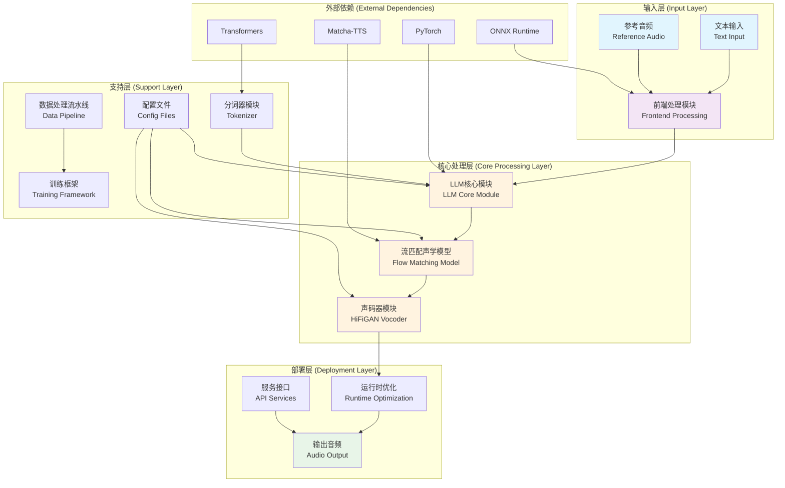
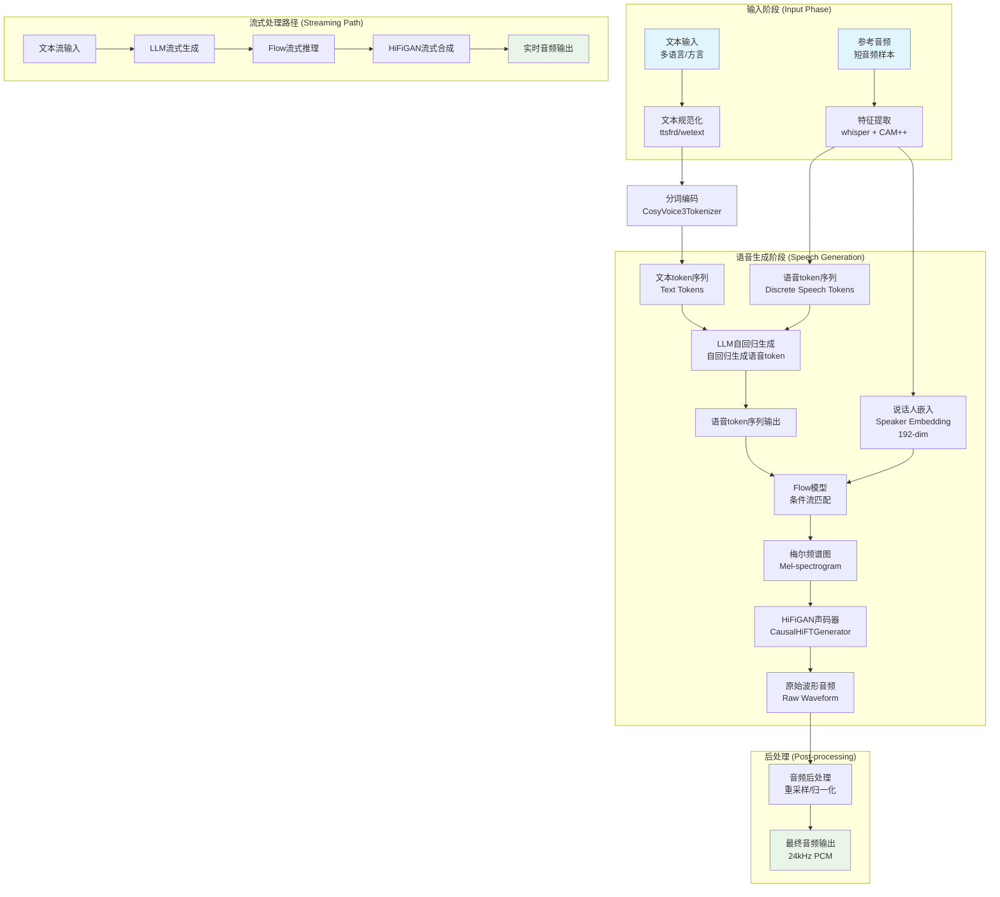
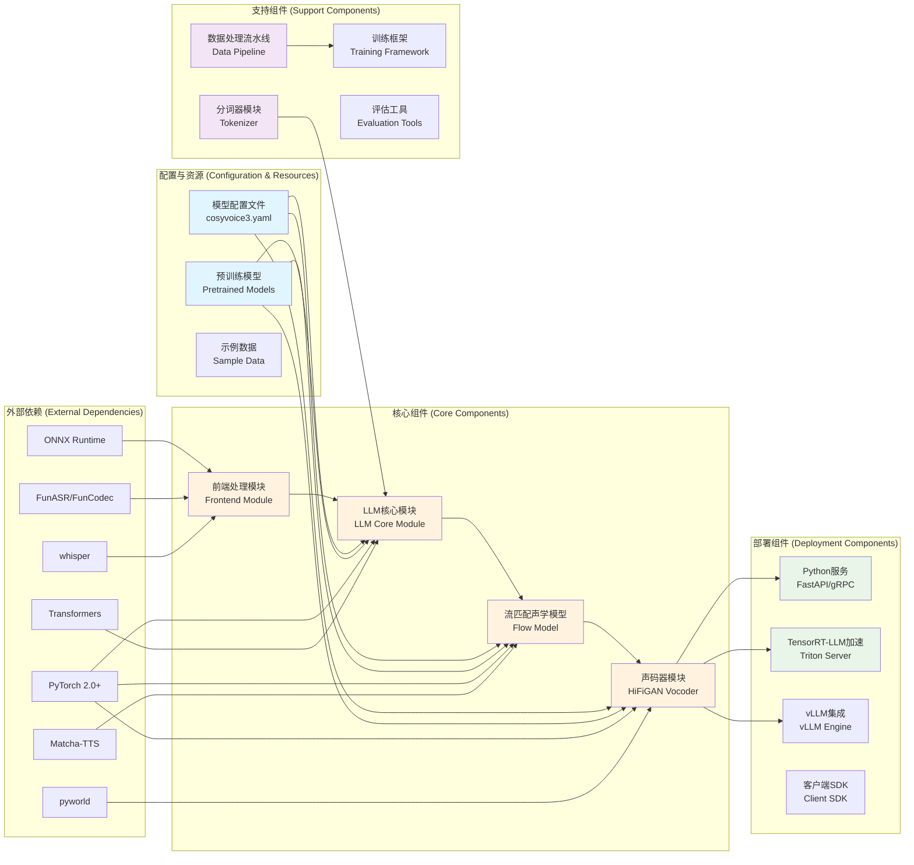

# CosyVoice3 系统架构图、数据流图和组件图

基于对CosyVoice项目的深入分析，本文档提供详细的系统架构图、数据流图和组件图，以及对应的Mermaid代码。

## 项目概述

**CosyVoice** 是由阿里巴巴 FunAudioLLM 团队开发的大语言模型（LLM）驱动的文本到语音（TTS）系统。项目基于大规模语音数据训练，实现了高质量的零样本语音合成、跨语言语音转换和细粒度语音控制。

**核心功能**：
- **多语言/零样本语音合成**：支持中文、英文、日文、韩文等9种主流语言和18+种中文方言口音
- **语音克隆与转换**：通过短音频参考实现高质量音色克隆
- **流式推理**：支持文本输入流和音频输出流，延迟低至150ms
- **指令控制**：支持语言、方言、情感、语速、音量等控制指令
- **文本规范化**：支持数字、特殊符号的多格式文本朗读

**版本演进**：
- **CosyVoice 1.0**：300M参数基础模型
- **CosyVoice 2.0**：0.5B参数，引入流式推理优化
- **Fun-CosyVoice 3.0**：0.5B参数，支持更多语言和指令控制

## 1. 系统架构图 (System Architecture Diagram)

**架构概述**：CosyVoice3采用模块化三阶段架构，将文本到语音的生成过程解耦为LLM语义生成、Flow声学建模和HiFiGAN波形合成三个核心阶段，支持流式推理和细粒度控制。

**关键特点**：
- **模块化设计**：LLM、Flow、HiFiGAN三阶段清晰分离，支持独立优化
- **多模态融合**：文本token和语音token联合建模，说话人嵌入作为条件输入Flow声学模型
- **流式友好**：全链路支持低延迟(150ms)实时语音合成
- **扩展性强**：通过配置文件灵活调整模型结构和超参数

### Mermaid 代码

### 主要组件说明

| 组件 | 文件路径 | 功能描述 |
|------|----------|----------|
| **前端处理模块** | `cosyvoice/cli/frontend.py` | 文本规范化、语音特征提取、说话人特征提取 |
| **LLM核心模块** | `cosyvoice/llm/llm.py` | 基于Transformer的语音语言模型，支持文本和语音token联合建模 |
| **流匹配声学模型** | `cosyvoice/flow/flow.py` | 将离散语音token转换为连续梅尔频谱特征 |
| **声码器模块** | `cosyvoice/hifigan/` | HiFiGAN生成对抗网络，将梅尔谱转换为波形音频 |
| **数据处理流水线** | `cosyvoice/dataset/` | 可组合的数据处理流水线，支持parquet格式批量处理 |
| **分词器模块** | `cosyvoice/tokenizer/tokenizer.py` | CosyVoice3Tokenizer，支持拼音和CMU音素 |

## 2. 数据流图 (Data Flow Diagram)

**数据流概述**：数据从文本和音频输入开始，经过多阶段转换最终输出合成音频，支持零样本语音克隆和跨语言合成。

### Mermaid 代码

### 数据流关键路径

1. **文本预处理路径**：文本 → 规范化 → 分词 → 文本token序列
2. **参考音频路径**：音频 → 梅尔谱提取 → 语音token序列 + 说话人嵌入
3. **语音合成路径**：文本token → LLM → 语音token → Flow(带说话人嵌入) → 梅尔谱 → HiFiGAN → 波形
4. **流式路径**：支持文本分块输入，实时生成音频，采用重叠-相加技术保证连续性

## 3. 组件图 (Component Diagram)

**组件概述**：展示CosyVoice项目的物理和逻辑组件，包括核心模块、支持模块、配置文件和外部依赖。

### Mermaid 代码

### 组件详细说明

| 组件类别 | 组件名称 | 主要文件/路径 | 功能描述 |
|---------|---------|--------------|----------|
| **核心组件** | 前端处理模块 | `cosyvoice/cli/frontend.py` | 文本规范化、语音特征提取、说话人特征提取 |
| | LLM核心模块 | `cosyvoice/llm/llm.py` | Transformer语音语言模型，支持200个特殊token |
| | 流匹配声学模型 | `cosyvoice/flow/flow.py` | 条件流匹配模型，生成梅尔频谱图 |
| | 声码器模块 | `cosyvoice/hifigan/` | HiFiGAN生成对抗网络，波形合成 |
| **支持组件** | 数据处理流水线 | `cosyvoice/dataset/` | 可组合数据处理，支持过滤、重采样、批处理 |
| | 分词器模块 | `cosyvoice/tokenizer/tokenizer.py` | CosyVoice3Tokenizer，支持拼音和CMU音素 |
| | 训练框架 | `examples/libritts/` | 训练配置和脚本 |
| **配置资源** | 模型配置文件 | `examples/libritts/cosyvoice3/conf/` | YAML配置文件定义模型结构和超参数 |
| | 预训练模型 | `pretrained_models/` | 预训练模型检查点 |
| **部署组件** | Python服务 | `runtime/python/` | FastAPI和gRPC接口 |
| | TensorRT-LLM加速 | `runtime/tensorrt_llm/` | Triton推理服务器集成 |
| | vLLM集成 | 集成vLLM引擎 | 提升推理效率 |

## 4. 图表使用说明

### 如何渲染这些图表

1. **在线渲染**：
   - 访问 [Mermaid Live Editor](https://mermaid.live/)
   - 粘贴上述Mermaid代码
   - 图表将自动渲染

2. **本地渲染**：
   - **VS Code**：安装"Mermaid Preview"扩展
   - **Typora**：原生支持Mermaid
   - **Obsidian**：启用"Mermaid"插件
   - **GitLab/GitHub**：在Markdown文件中直接使用代码块

3. **导出为图像**：
   - 在Mermaid Live Editor中渲染后，点击下载按钮导出为PNG/SVG
   - 使用`mermaid-cli`命令行工具批量导出

### 关键架构决策

1. **三阶段解耦**：LLM（语义）→ Flow（声学）→ HiFiGAN（波形）的分离设计允许：
   - 独立优化每个阶段
   - 更换声学模型或声码器而不影响其他组件
   - 并行开发和测试

2. **流式处理设计**：
   - LLM支持双流(bi-stream)生成
   - Flow和HiFiGAN提供因果(causal)版本
   - 重叠-相加技术保证音频连续性

3. **多语言支持**：
   - 统一的文本前端处理
   - 语言ID作为控制token
   - 方言和口音细粒度控制

4. **生产就绪特性**：
   - ONNX Runtime加速特征提取
   - vLLM集成提升推理吞吐量
   - 完整的服务化部署方案

## 5. 训练与推理流程

### 训练流程：
1. **数据准备**：将音频-文本对转换为parquet格式，包含音频数据、文本、语音token、说话人嵌入
2. **LLM预训练**：使用语音token序列训练自回归语言模型
3. **Flow模型训练**：训练条件流匹配模型，从语音token生成梅尔谱
4. **GAN训练**：联合训练HiFiGAN声码器

### 推理流程：
1. **初始化模型**：加载LLM、Flow、HiFiGAN三个组件
2. **前端处理**：文本规范化、提取参考音频特征
3. **语音token生成**：LLM自回归生成离散语音token序列
4. **梅尔谱生成**：Flow模型将语音token转换为梅尔频谱
5. **波形合成**：HiFiGAN将梅尔谱转换为最终音频波形

## 6. 总结

CosyVoice3的系统架构体现了现代语音合成系统的设计理念：

1. **模块化与可扩展性**：清晰的组件边界和接口定义，便于功能扩展和性能优化
2. **流式优先设计**：从模型架构到推理引擎全链路支持低延迟实时合成
3. **多模态融合**：文本、语音、说话人信息的深度融合建模
4. **生产就绪**：提供从训练、推理到部署的完整工具链

这些图表共同描绘了CosyVoice3作为大语言模型驱动TTS系统的完整技术架构，为理解、开发和优化该系统提供了清晰的视觉参考。

**文件路径参考**：
- 核心代码目录：`/home/stars/work/CosyVoice/CosyVoice/cosyvoice/`
- 配置文件：`/home/stars/work/CosyVoice/CosyVoice/examples/libritts/cosyvoice3/conf/cosyvoice3.yaml`
- 示例代码：`/home/stars/work/CosyVoice/CosyVoice/example.py`

---
*文档生成时间：2026-01-16*  
*基于对CosyVoice项目的架构分析生成*