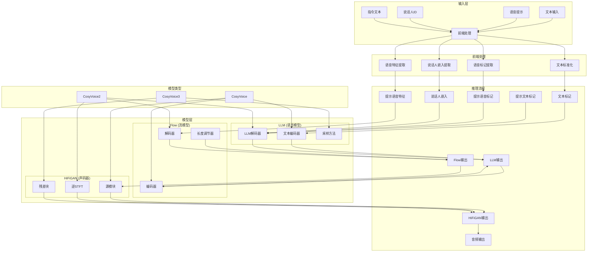
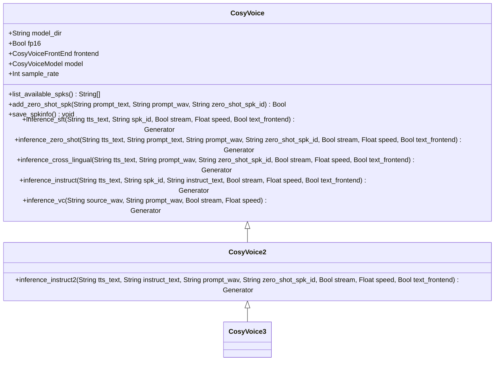
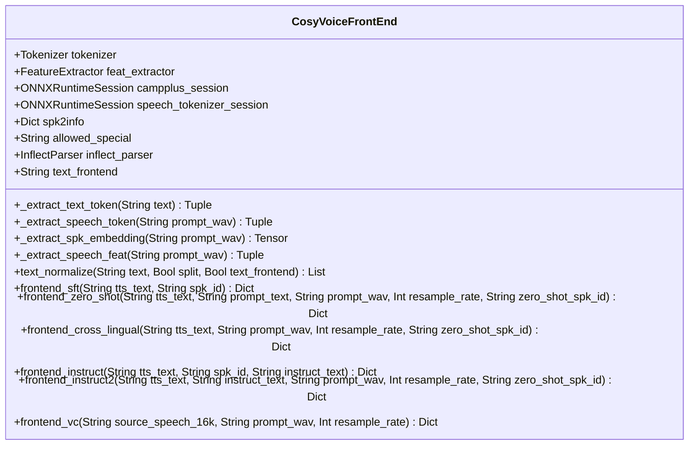
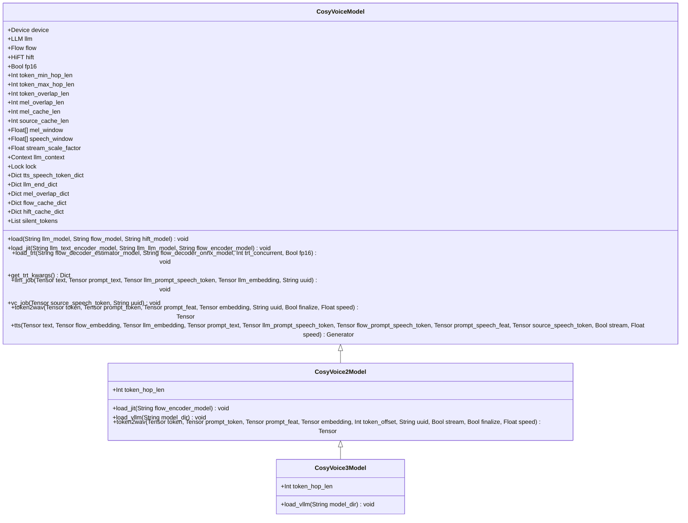
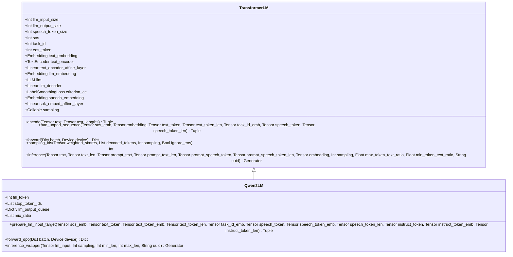
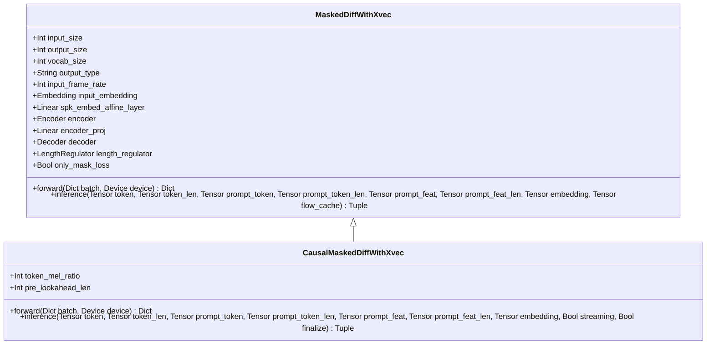
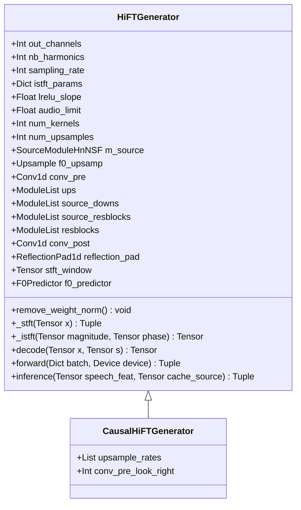
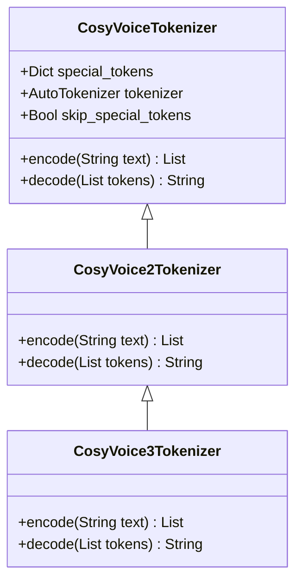
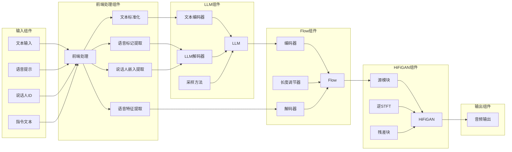
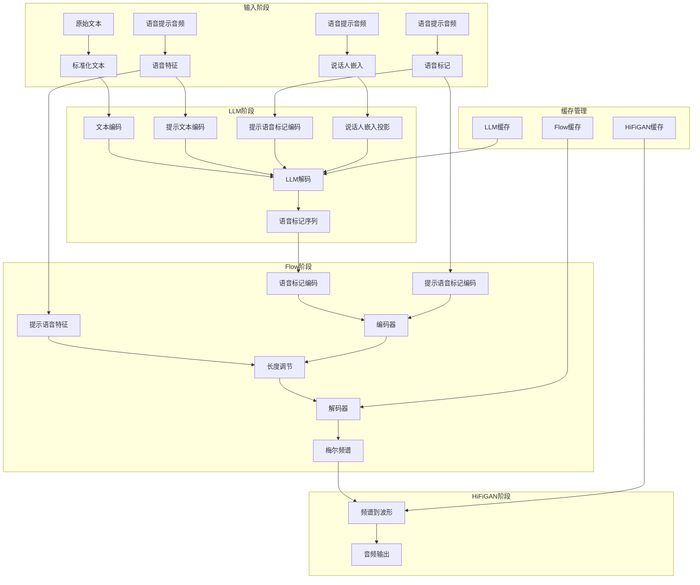

# CosyVoice 详细架构文档

## 1. 项目概述

CosyVoice 是一个基于大型语言模型（LLM）的先进文本到语音（TTS）系统，支持多语言、多方言的语音合成。它实现了零样本语音克隆、发音修复、文本标准化等功能，并支持流式传输。

## 2. 系统架构图

## 3. 类图

### 3.1 主模型类图

### 3.2 前端处理类图

### 3.3 模型层类图

### 3.4 语言模型类图

### 3.5 流模型类图

### 3.6 声码器类图

### 3.7 分词器类图

## 4. 组件图

## 5. 数据流图

## 6. 模块详解

### 6.1 前端处理 (Frontend)

前端处理模块负责将输入的文本、语音提示和说话人信息转换为模型可以处理的格式。

- **文本标准化**: 使用 `ttsfrd` 或 `wetext` 对输入文本进行标准化处理。
- **语音标记提取**: 从语音提示中提取语音标记。
- **说话人嵌入提取**: 从语音提示中提取说话人嵌入向量。
- **语音特征提取**: 从语音提示中提取声学特征。

### 6.2 语言模型 (LLM)

语言模型负责将文本和上下文信息转换为语音标记序列。

- **文本编码器**: 将文本转换为向量表示。
- **LLM解码器**: 基于文本、上下文和说话人信息生成语音标记。
- **采样方法**: 用于从模型输出的概率分布中采样语音标记。

### 6.3 流模型 (Flow)

流模型负责将语音标记转换为声学特征。

- **编码器**: 将语音标记转换为中间表示。
- **长度调节器**: 调节序列长度以匹配声学特征长度。
- **解码器**: 将中间表示转换为声学特征。

### 6.4 声码器 (HiFiGAN)

声码器负责将声学特征转换为音频波形。

- **源模块**: 生成激励信号。
- **逆STFT**: 将频域特征转换为时域信号。
- **残差块**: 对音频进行精细化处理。

## 7. 模型类型

### 7.1 CosyVoice

基础模型，包含 LLM、Flow 和 HiFiGAN 三个模块。

### 7.2 CosyVoice2

在 CosyVoice 基础上进行了优化，支持流式处理和 vLLM 加速。

### 7.3 CosyVoice3

最新版本，进一步优化了模型结构和性能，支持更复杂的任务。

## 8. 推理流程

1. **输入处理**: 将文本、语音提示和说话人信息转换为模型输入格式。
2. **LLM 推理**: 生成语音标记序列。
3. **Flow 推理**: 将语音标记转换为声学特征。
4. **HiFiGAN 推理**: 将声学特征转换为音频波形。
5. **输出**: 生成最终的音频输出。

## 9. 关键特性

- **多语言支持**: 支持中文、英文、日文、韩文等多种语言。
- **多方言支持**: 支持多种中文方言和口音。
- **零样本语音克隆**: 仅需几秒语音提示即可克隆说话人声音。
- **流式处理**: 支持实时流式语音合成。
- **指令控制**: 支持通过指令控制语音的情感、语速、音量等属性。